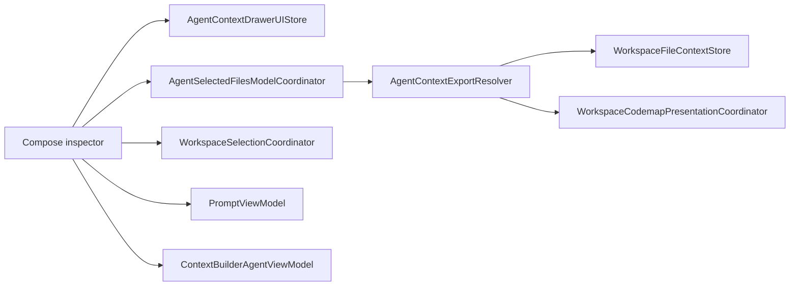

# Compose Inspector

This contributor guide covers the Agent Mode Compose inspector, including selected-context review, prompt packaging, Copy Prompt, Context Builder, and the services that support them.

## Scope and goals

Compose lets a user review the context selected for the current agent chat, shape the prompt handed to another model, and run Context Builder without leaving the transcript.

The inspector renders a resolved view of the current selection and sends user changes through the shared workspace selection services. Repository lookup, codemap resolution, and selection persistence stay outside the view layer; [`source-layout.md`](source-layout.md) defines the source-ownership boundary.

Inspector visibility and navigation are scoped to the current app window. Selections, prompt settings, and Context Builder state use the feature's existing stores.

## User-facing behavior

### Open and close

Compose opens from the **Compose** button in the top-right Agent Mode toolbar, from the selected-context pill below the composer, or from `⌘P` (configurable under Settings → Keyboard Shortcuts → Toggle Compose). The toolbar and shortcut toggle the inspector. The selected-context pill opens **Selections**, switches to it from another Compose tab, or closes the inspector when **Selections** is already active. The header control closes the inspector directly.

The native macOS inspector column is resizable and adapts to preserve useful space for the chat.

### Selections

The **Selections** tab presents the context selected for the current agent chat, separating full and sliced files under **Files** from codemap-only entries under **Codemaps**. Users can filter by file name, path, root, or directory and sort by name or token count. Each row identifies its workspace root and selection mode, with token, context-percentage, and line-count metrics when available. Row actions support previewing, copying, removing, changing the selection mode, clearing slices, copying paths, opening files, and revealing files in Finder. **Clear** removes all displayed selections.

### Prompt

The **Prompt** tab combines receiving-model instructions with clipboard packaging controls: the Standard, Plan · Architect, Review, and Manual copy presets; stored prompts; and File Tree, Code Map, and Git options. Changing File Tree, Code Map, or Git selects the Manual preset. Copy Prompt uses the current prompt text and selection when clicked.

### Context Builder

The **Context Builder** tab explores the workspace, curates context within the configured budget, and produces Plan, Review, or Question output. Generated output can become the prompt, be copied or previewed, or open in the Agent Mode Oracle popover.

### Loading behavior

When the active chat changes, Compose waits for the new chat's selection before showing rows and totals. During updates to the current chat, matching rows remain visible while their data refreshes. File and codemap counts become available independently, and metrics remain hidden until their values are known.

## Layering



`AgentModeDetailWithSidebarView` mounts the native inspector beside the chat. `AgentContextInspectorPresenter` connects its visibility to the presentation store, and `AgentContextControlDrawerView` owns the tab shell and selected-context model lifecycle.

## Invariants and rationale

**Observation isolation.** Compose detail state is observed within the inspector subtree. The chat surface receives only the presentation state and the action that opens Compose, keeping filter, sort, navigation, loading, and row updates from invalidating the transcript.

**Native inspector layout.** SwiftUI's `.inspector` owns width, resizing, cursor behavior, and resize persistence. `AgentContextInspectorColumnSizing` derives a bounded inspector width from the available detail width so the chat remains usable in narrow layouts.

**Context-aware loading.** `AgentSelectedFilesModelCoordinator` distinguishes the requested context, the context currently displayed, and any context being loaded. Rows are mutable only when the displayed data belongs to the active context and no replacement load is underway. A chat switch therefore withholds stale rows, while an update within the same chat can keep matching rows visible and read-only until the refresh completes.

**Current-state copying.** Copy Prompt flushes pending selection edits, reads the current prompt, and captures the active selection and worktree bindings when clicked. Cached lookup data is reused only when it belongs to that same context.

**Explicit readiness.** Counts and metrics carry readiness independently. Unknown values remain pending rather than appearing as zero, and the header token estimate appears only for a complete, current selection snapshot.

## State ownership

| Concern | Owner |
| --- | --- |
| Inspector visibility | `AgentContextDrawerPresentationStore` |
| Active tab, filter, and sort | `AgentContextDrawerDetailStore` |
| Open, close, and toggle behavior shared by Compose entry points | `AgentContextDrawerUIStore` |
| Selected files and active-tab mutations | `StoredSelection` and `WorkspaceSelectionCoordinator` |
| Instructions, copy configuration, and token counting | `PromptViewModel` |
| Context Builder execution and generated output | `ContextBuilderAgentViewModel` |
| Selected-context loading, readiness, caching, and mutation gating | `AgentSelectedFilesModelCoordinator` |

## Selected-context model

`AgentContextExportViewContext` captures the active Compose tab, agent session, prompt, selection, and worktree bindings. `AgentContextExportResolver` maps that context to display rows, metrics, previews, and clipboard content. Selection changes return through `WorkspaceSelectionCoordinator`, which updates the active tab's `StoredSelection`. Metrics distinguish known values from values that are still loading.

## Copy pipeline

Copy Prompt assembles the clipboard content from a single snapshot of the active context:

1. Capture the current prompt, selection, worktree bindings, and matching lookup data.
2. Resolve stored prompts and Git review context.
3. Resolve the codemaps needed by the selected copy configuration.
4. Collect selected file content, project structure, and Git diff content.
5. Package the configured sections and write them to the pasteboard.

## Validation

Start with the focused suite for the boundary being changed:

```bash
make dev-test FILTER=AgentContextDrawerUIStoreTests
make dev-test FILTER=AgentContextExportResolverTests
make dev-test FILTER=AgentSelectedFilesModelCoordinatorTests
make dev-test FILTER=AgentContextInspectorColumnSizingTests
```

Selection-card presentation, token accounting, Git actions, and chat-switch behavior have additional focused coverage in `AgentContextSelectedFileCardTests`, `TokenCountingViewModelTests`, `GitViewModelSelectionClearTests`, and `AgentModeChatSwitchActivationTests`. Use the contribution matrix in [`../../AGENTS.md`](../../AGENTS.md) for repository-wide lint, build, and PR-ready gates. Because Compose is running-app Agent Mode UI, also follow the live CE MCP smoke flow there when behavior changes.

## References

- `Sources/RepoPrompt/Features/AgentMode/Views/AgentModeDetailWithSidebarView.swift` — native inspector mounting, presenter, and detail-width column policy.
- `Sources/RepoPrompt/Features/AgentMode/Views/ContextDrawer/` — Compose shell, tabs, selected-context rows, previews, and click-time export context.
- `Sources/RepoPrompt/Features/AgentMode/ViewModels/UI/AgentContextDrawerUIStore.swift` — presentation and runtime detail state.
- `Sources/RepoPrompt/Features/AgentMode/ViewModels/UI/AgentSelectedFilesModelCoordinator.swift` — context-aware loading, caching, readiness, and mutation gating.
- `Sources/RepoPrompt/Features/AgentMode/Services/AgentContextExportResolver.swift` — selection resolution, previews, metrics, and clipboard assembly.
- `Sources/RepoPrompt/Features/AgentMode/Services/AgentSelectedFilesDiagnostics.swift` — opt-in selected-context loading and readiness diagnostics.
- `Sources/RepoPrompt/Infrastructure/WorkspaceContext/Selection/WorkspaceSelectionCoordinator.swift` — active-tab selection mutation.
- `Sources/RepoPrompt/Infrastructure/WorkspaceContext/Presentation/WorkspaceCodemapPresentationCoordinator.swift` — codemap readiness and presentation coordination.
- [`source-layout.md`](source-layout.md) — source ownership rules for Agent Mode feature code and workspace-context infrastructure.
